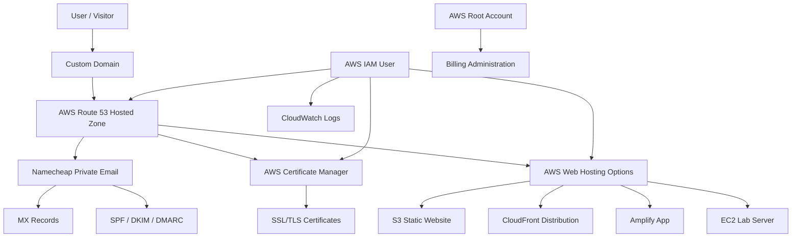
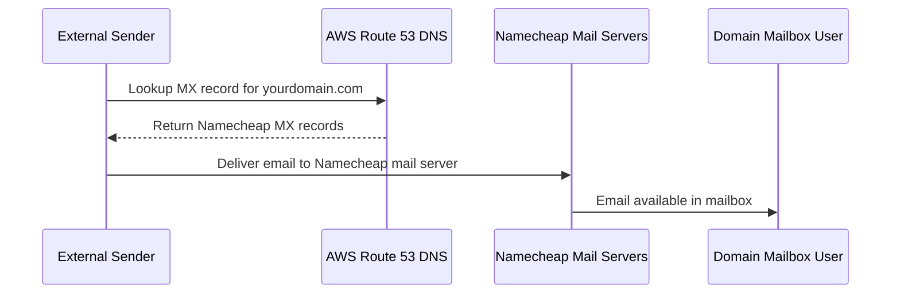
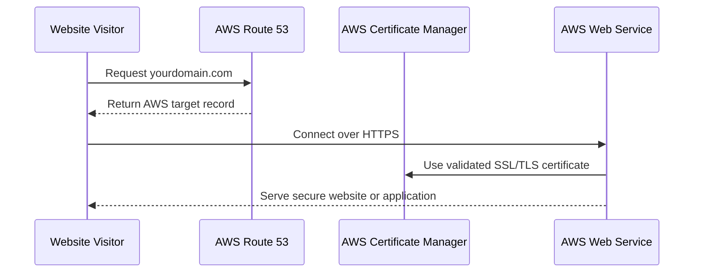
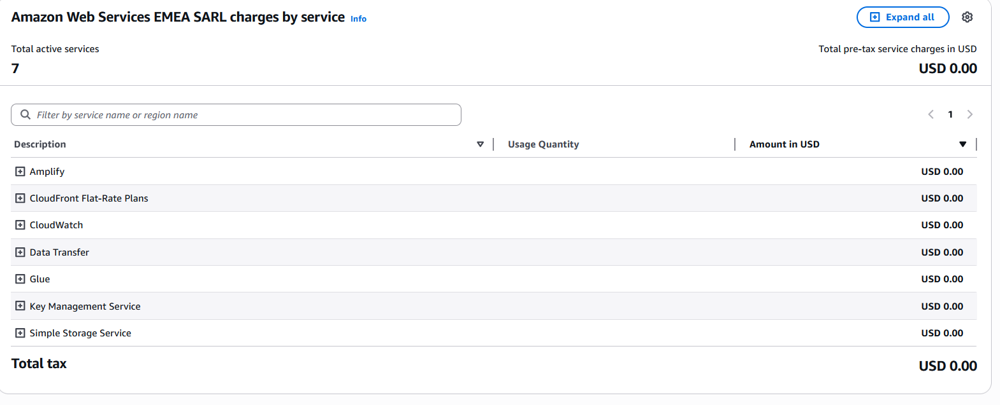

# Cost-Optimised Domain, DNS, Email and AWS Hosting Foundation

## Project Overview

This repository documents a low-cost, security-conscious domain, DNS, email and cloud experimentation setup using **AWS Route 53**, **AWS Certificate Manager**, **Namecheap Private Email**, and selected AWS services such as **S3**, **CloudFront**, **CloudWatch**, and **EC2**.

The project demonstrates how an individual, startup, charity, freelancer, or small business can build a professional online identity with a custom domain, branded email address, SSL/TLS capability, and a reusable AWS foundation for future cloud experiments without committing to expensive monthly platforms.

The solution is designed to support:

- Personal branding for job seekers and professionals
- Custom email addresses such as `name@yourdomain.com`
- Startup and small-business email identity
- Charity and community organisation web presence
- AWS cloud labs and portfolio projects
- Secure DNS and email routing
- Low-cost web hosting experiments
- SSL/TLS certificates for AWS-hosted services
- Cost monitoring and billing awareness

---

## Author Background

This project reflects my hands-on background in **DNS, networking, email infrastructure, cloud services, cybersecurity, and infrastructure operations**.

My technical foundation comes from working in both **ISP** and **banking** environments, including roles such as:

- Core Network Engineer in an ISP environment
- IT Networks and Infrastructure Support Manager in banking
- Hands-on Network and Infrastructure Manager supporting enterprise systems
- Cybersecurity and cloud learner building practical portfolio projects

Relevant experience includes:

- DNS and public internet services
- ISP routing and infrastructure operations
- Enterprise network support
- Banking infrastructure availability and security
- Firewall and perimeter security operations
- Email security awareness
- SSL/TLS certificate use
- Cloud DNS and hosting design
- Cost-aware infrastructure planning

This repository is intentionally practical. It is based on a real-world setup that shows how infrastructure experience can be applied to help individuals and small organisations build a professional online presence at low cost.

---

## Problem Statement

Many individuals, startups, charities and small organisations need a professional domain and branded email address, but they often assume the setup will be expensive or difficult to manage.

Common challenges include:

- High monthly email and web-hosting costs
- Confusion around DNS records
- Lack of understanding of MX, SPF, DKIM and DMARC
- Poor visibility of cloud billing
- Fear of unexpected AWS costs
- Weak account security
- No clear separation between domain, DNS, email and web hosting

This project solves that by showing a simple, modular and affordable design.

---

## Solution Summary

The setup separates domain, DNS, email and cloud services into clear layers.

| Layer | Service Used | Purpose |
|---|---|---|
| Domain | AWS Route 53 domain registration | Own and renew the custom domain |
| DNS | AWS Route 53 hosted zone | Manage authoritative DNS records |
| Email hosting | Namecheap Private Email | Provide affordable mailbox hosting |
| Email routing | MX records in Route 53 | Route inbound email to Namecheap |
| Email authentication | SPF, DKIM and DMARC records | Improve email trust and reduce spoofing |
| SSL/TLS | AWS Certificate Manager | Issue certificates for AWS-hosted services |
| Web experiments | S3, CloudFront, Amplify or EC2 | Host websites, demos and labs |
| Monitoring | AWS CloudWatch and AWS Billing | Track usage, logs and cost exposure |
| Security | MFA, IAM and least privilege | Reduce account compromise risk |

---

## Current Security Posture

The real setup behind this repository uses the following security practices:

- MFA enabled on the AWS account
- MFA enabled on the Namecheap account
- Different MFA providers used for AWS and Namecheap to reduce single-provider dependency
- AWS root account reserved for billing and high-privilege administration only
- IAM user created for day-to-day AWS administration
- IAM user restricted to approved services such as:
  - Route 53
  - AWS Certificate Manager
  - S3
  - EC2 creation for controlled labs
  - CloudWatch Logs
- Billing administration retained under the AWS root account
- DNS records managed centrally in Route 53
- Email hosting delegated to Namecheap using MX records
- SPF configured to authorise the email provider
- AWS billing dashboard reviewed to confirm low or zero service charges during light usage

This setup demonstrates practical cloud governance: use root only where necessary, use IAM for operational tasks, protect accounts with MFA, and monitor billing regularly.

---

## High-Level Architecture

---

## Email Routing Flow

---

## Web and Certificate Flow

---

## Skills Demonstrated

This repository demonstrates the following practical skills:

### DNS and Internet Services

- Domain registration
- Authoritative DNS management
- Route 53 hosted zones
- Name server delegation
- MX record configuration
- TXT records for SPF
- CNAME records for validation
- DNS troubleshooting

### Email Hosting and Authentication

- Custom domain email setup
- Namecheap Private Email integration
- MX record routing
- SPF record publishing
- DKIM and DMARC planning
- Email spoofing risk reduction
- Mail flow documentation

### AWS Cloud Skills

- Route 53
- AWS Certificate Manager
- S3
- CloudFront
- EC2 lab readiness
- CloudWatch Logs
- AWS billing awareness
- IAM user design
- Root account separation
- MFA hardening

### Security and Governance

- MFA across providers
- Least privilege IAM access
- Separation of billing and operations
- Cloud cost control
- Security-conscious DNS administration
- Documentation-driven operations
- Small-business infrastructure design

### Professional Value

This project shows how technical infrastructure knowledge can directly support:

- Personal branding
- Recruiter visibility
- Professional communication
- Startup launch readiness
- Charity cost control
- Cloud portfolio development
- Secure digital identity

---

## Example Cost Model

The real setup is designed around a very low yearly cost model:

| Item | Charging Model | Notes |
|---|---|---|
| Domain registration | Yearly | Domain registered through AWS |
| Namecheap email hosting | Yearly | Low-cost mailbox hosting |
| Route 53 hosted zone | Low monthly DNS cost | Used for authoritative DNS |
| AWS Certificate Manager | No additional cost for public certificates used with supported AWS services | Used for SSL/TLS validation |
| S3 / CloudFront / Amplify | Usage-based | Suitable for small static sites and labs |
| EC2 | Usage-based | Only used when required for experiments |

The key cost-control principle is to avoid unnecessary always-on resources and to monitor AWS billing regularly.

---

## Billing Evidence

The screenshot below shows AWS service charges at zero for the current light-use setup at the time of capture.

---

## DNS Validation Evidence

The repository includes terminal screenshots showing the `dig` validation results for the live domain configuration at the time of testing.

Evidence captured includes:

- `dig poulmhiripiri.co.uk NS` to confirm AWS Route 53 authoritative name servers
- `dig poulmhiripiri.co.uk MX` to confirm Namecheap Private Email mail routing
- `dig poulmhiripiri.co.uk` to confirm A records configured at that time
- `dig poulmhiripiri.co.uk TXT` to confirm SPF email authentication
- `dig poulmhiripiri.co.uk SOA` to confirm hosted zone authority
- `dig +short` outputs for concise NS, MX and A record validation

See the full evidence page: [DNS Validation Evidence](docs/dns-validation-evidence.md)

---

## Recommended Repository Use Cases

This repository can be reused as a reference design for:

- A professional IT portfolio domain
- A startup landing page and email foundation
- A charity domain and low-cost mailbox setup
- A cybersecurity lab domain
- A personal AWS learning environment
- A GitHub project showcase domain
- A freelance consultant identity

---

## Future Enhancements

Planned improvements include:

- Add Terraform for Route 53 DNS records
- Add Terraform for S3 and CloudFront static website hosting
- Add GitHub Actions deployment workflow
- Add DKIM and DMARC examples
- Add AWS Budget alert configuration
- Add CloudWatch log retention examples
- Add troubleshooting examples for DNS and email delivery

---

## Disclaimer

This repository is for educational and portfolio purposes. Pricing, service limits and provider features may change over time. Always check the latest AWS and Namecheap pricing before adopting the setup.
