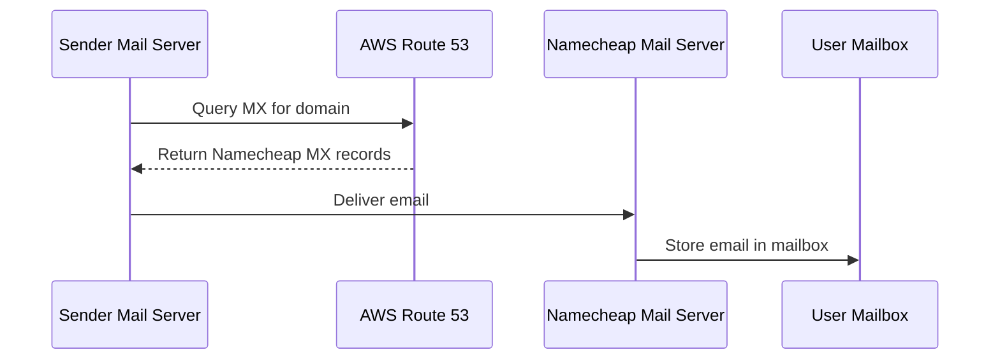
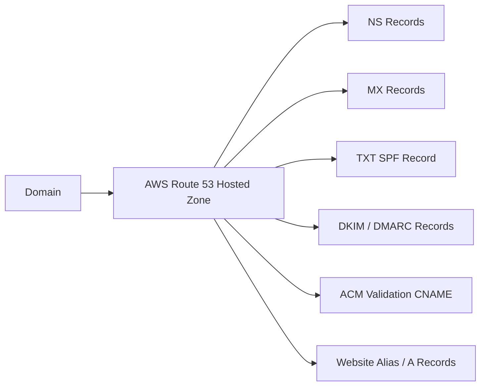

# DNS and Email Flow

## Inbound Email Flow

```mermaid
sequenceDiagram
    participant S as Sender Mail Server
    participant R as AWS Route 53
    participant N as Namecheap Mail Server
    participant U as User Mailbox

    S->>R: Query MX for domain
    R-->>S: Return Namecheap MX records
    S->>N: Deliver email
    N->>U: Store email in mailbox
```

## DNS Control Flow

```mermaid
flowchart LR
    A[Domain] --> B[AWS Route 53 Hosted Zone]
    B --> C[NS Records]
    B --> D[MX Records]
    B --> E[TXT SPF Record]
    B --> F[DKIM / DMARC Records]
    B --> G[ACM Validation CNAME]
    B --> H[Website Alias / A Records]
```
