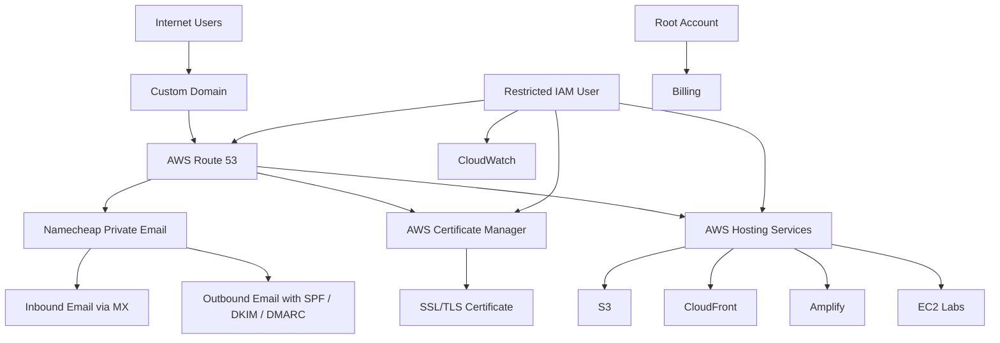

# High-Level Architecture

## Design Principles

- Keep email hosting separate from DNS hosting
- Use Route 53 as the central DNS control plane
- Use Namecheap for low-cost mailbox hosting
- Use AWS Certificate Manager for cloud-hosted SSL/TLS
- Use IAM instead of root for daily administration
- Use MFA on all critical accounts
- Monitor AWS billing regularly
