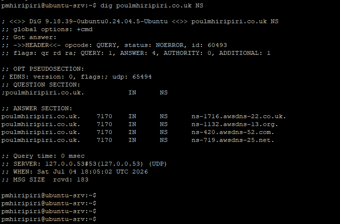
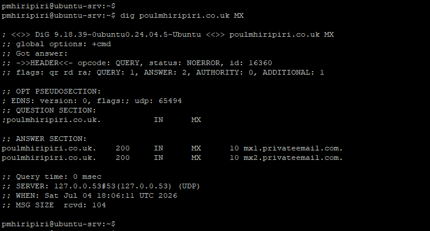
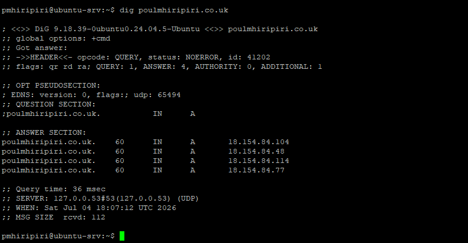
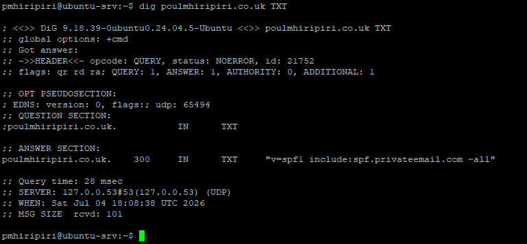
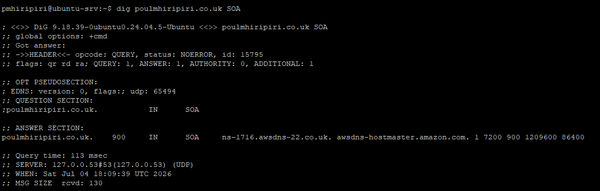
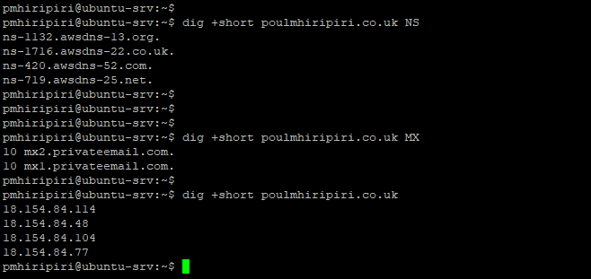

# DNS Validation Evidence

This page records the DNS validation evidence captured with the `dig` command for the domain used in this project.

The screenshots represent the DNS and subdomain configuration that existed at the time the tests were captured. DNS records may change over time as additional websites, subdomains, mail security controls, or AWS services are added.

## Tested Domain

`poulmhiripiri.co.uk`

## Capture Context

The evidence was captured from an Ubuntu terminal using `dig`.

The captured results demonstrate that:

- AWS Route 53 was authoritative for the domain through AWS name servers.
- Namecheap Private Email was configured as the email hosting provider through MX records.
- SPF was configured through a TXT record to authorise Namecheap mail sending.
- The apex/root domain had A records configured at that time.
- The SOA record confirmed the Route 53 hosted zone authority.
- A short-output summary was captured to make the key DNS answers easier to read.

## Commands Captured

| Screenshot | Command | Purpose |
|---|---|---|
| `dig-poulmhiripiri-co-uk-ns.png` | `dig poulmhiripiri.co.uk NS` | Confirms the AWS Route 53 authoritative name servers |
| `dig-poulmhiripiri-co-uk-mx.png` | `dig poulmhiripiri.co.uk MX` | Confirms the Namecheap Private Email MX records |
| `dig-poulmhiripiri-co-uk-a-records.png` | `dig poulmhiripiri.co.uk` | Confirms A records configured for the apex/root domain at that time |
| `dig-poulmhiripiri-co-uk-txt-spf.png` | `dig poulmhiripiri.co.uk TXT` | Confirms TXT/SPF email authentication record |
| `dig-poulmhiripiri-co-uk-soa.png` | `dig poulmhiripiri.co.uk SOA` | Confirms the Start of Authority record for the hosted zone |
| `dig-short-summary.png` | `dig +short` commands | Provides concise NS, MX, and A record answers |

## Observed DNS Results at Capture Time

### Name Server Records

The domain returned AWS Route 53 name servers:

```text
ns-1132.awsdns-13.org.
ns-1716.awsdns-22.co.uk.
ns-420.awsdns-52.com.
ns-719.awsdns-25.net.
```

This confirms that AWS Route 53 was the authoritative DNS platform for the domain at the time of testing.



### Mail Exchange Records

The domain returned Namecheap Private Email MX records:

```text
10 mx1.privateemail.com.
10 mx2.privateemail.com.
```

This confirms that inbound mail for the custom domain was routed to Namecheap Private Email.



### A Records

The apex/root domain returned A records at the time of capture:

```text
18.154.84.104
18.154.84.48
18.154.84.114
18.154.84.77
```

These records represent the web-facing DNS configuration that existed at that point in time.



### TXT / SPF Record

The domain returned an SPF TXT record authorising Namecheap Private Email:

```text
v=spf1 include:spf.privateemail.com ~all
```

This supports email authentication by identifying the provider authorised to send email on behalf of the domain.



### SOA Record

The SOA response confirms the hosted zone authority and AWS Route 53 DNS control plane details at the time of capture.



### Short Output Summary

The short-output screenshot provides a concise view of the configured NS, MX and A records.



## Why This Evidence Matters

This evidence demonstrates practical DNS and email hosting skills, including:

- Validating authoritative name servers
- Confirming MX-based mail routing
- Checking TXT/SPF records for email authentication
- Reviewing web-facing DNS records
- Using command-line tooling for infrastructure verification
- Documenting DNS state at a point in time for audit and portfolio purposes

For individuals, startups, charities, and small businesses, this approach provides a simple way to prove that domain, DNS, email, and web records are configured correctly.
